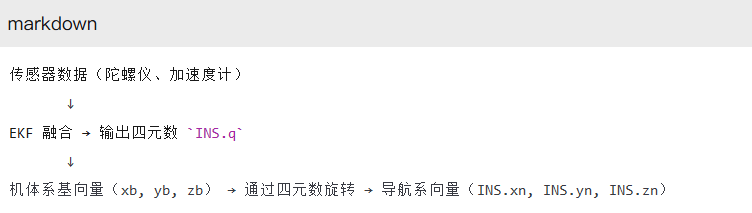

# 四元数
## 机体系向量
### 特点
* ​固定不变性：
在机体系中，xb, yb, zb 的定义始终不变。例如，即使无人机倒置，其机体系的 zb 仍然指向机身底部（此时可能对应地球坐标系中的“天空”方向）。
* ​正交性：
三个基向量彼此垂直，满足：
xb⋅yb=0,yb⋅zb=0,zb⋅xb=0
* ​单位长度：
每个基向量的长度为 1：
∣xb∣=∣yb∣=∣zb∣=1
## 惯性导航坐标系以及惯性系
* 导航坐标系：描述设备运动的全局参考系，本例中选择 ​惯性系 是为了简化计算。
* ​惯性系：短时间内的近似不旋转坐标系，适合无人机、手机等短期导航场景。
* ​机体系到惯性系的转换：通过四元数将设备的局部方向映射到全局空间，核心功能是回答“设备头朝哪、右朝哪、底朝哪”。
* ​局限性：长时间使用需切换坐标系并补偿地球自转。
## 四元数 q=[w,x,y,z] 的四个参数共同描述三维空间中的旋转，具体作用如下：
### ​实部 w
表示旋转角度的一半的余弦值，即 w=cos(θ/2)，其中 θ 是旋转角度。
当 w 接近 1 或 −1 时，旋转角度 θ 接近 0∘ 或 360∘ ，表示无实际旋转；当 w=0 时，θ=180∘ 
### ​虚部 x,y,z
共同确定旋转轴的方向。每个分量为旋转轴方向分量乘以 sin(θ/2)，即：
x=uxsin(θ/2),y=uysin(θ/2),z=u zsin(θ/2),其中 (ux,uy,uz) 是单位旋转轴向量。
虚部分量的绝对值越大，表示旋转角度越大或该方向的分量在旋转轴中占比更高。例如，若 x 较大且 y,z 较小，则旋转轴更接近 x-轴方向。
#### 关键点总结
​参数联合作用：四元数的四个参数需共同使用，通过 w 确定旋转角度，虚部确定旋转轴方向和角度大小。
​单位四元数约束：满足 w^2+x^2+y^2+z^2=1，确保旋转有效性。
​几何意义：四元数通过紧凑的形式避免万向节锁，支持高效的旋转组合与插值（如球面线性插值）。
示例：绕 z-轴旋转 90∘的四元数为 [cos(45∘),0,0,sin(45∘)]≈[0.707,0,0,0.707]，其中 w 表示 45∘的余弦，虚部 z 表示旋转轴方向。
## 转换流程
### 图解

* ​传感器数据：
读取陀螺仪（BMI088.Gyro）和加速度计（BMI088.Accel）的原始数据。
* ​姿态解算：
通过 IMU_QuaternionEKF_Update 函数，融合陀螺仪积分和加速度计校正，更新四元数 INS.q。
* ​坐标系转换：
调用 BodyFrameToEarthFrame，将机体系的三个基向量（xb, yb, zb）分别转换为导航系的 INS.xn, INS.yn, INS.zn。
